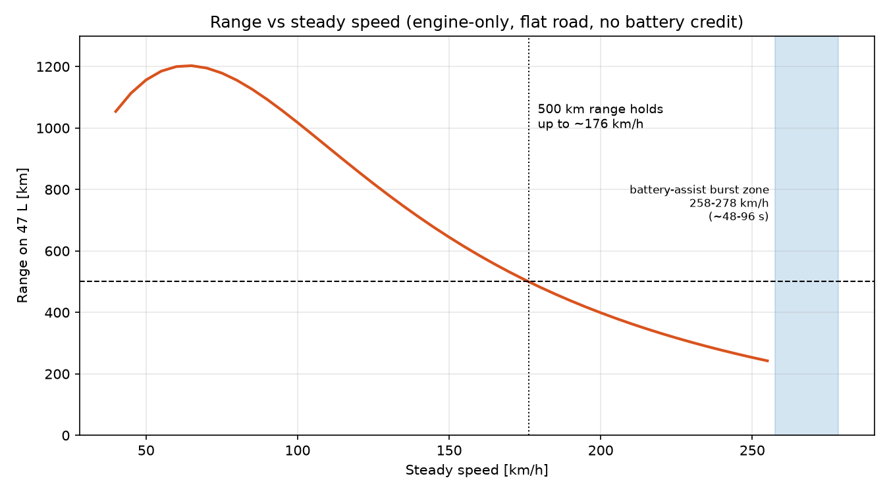
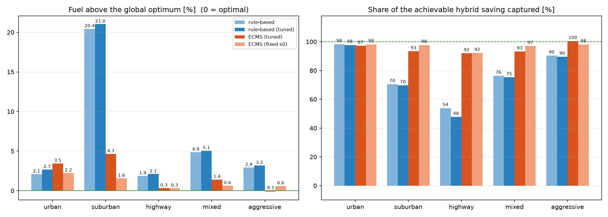

# Hybrid Energy-Management Simulator

Built with AI assistance (Claude); results reproduced and verified by the author.

A quasi-static, backward-facing simulator for the petrol turbo-hybrid in
*Petrol_Turbo_Hybrid_Full_Report.docx*. It answers: **given a driving cycle, how should the engine and the
MGU-K share the load, and what does that do to fuel use, range and top speed?** A dynamic-programming (DP)
benchmark then measures how close the practical controllers get to the best possible one.

## Run it

```bash
pip install -r requirements.txt          # numpy, matplotlib
python -m unittest -v                    # 26 checks (physics, constraints, DP, fairness)
python run_demo.py                       # main study + sensitivity       -> ./results
python run_dp_benchmark.py               # DP optimum vs ECMS vs rules    -> ./results
python run_demo.py --cycle-csv wltc.csv  # add an official cycle (columns: time_s,speed_kmh, 1 s steps)
```

Files: `hybrid_sim.py` (model, strategies, DP), `run_demo.py`, `run_dp_benchmark.py`, `test_hybrid_sim.py`, `results/`.

## What is modelled

```
engine ──┬──> transmission ──> wheels          (P2 parallel hybrid)
         │
MGU-K <──┴──> battery <── MGU-H (turbo shaft)
```

- **Vehicle**: drag, speed-dependent rolling resistance, inertia, transmission loss.
- **Engine**: Willans-line fuel model (idle fuel + linear + quadratic high-load term), 160 kW.
- **MGU-K**: 40 kW assist/regen with efficiency, regen blending limit, no regen below 1.5 m/s.
- **Battery**: 1.5 kWh, equivalent circuit (open-circuit voltage + internal resistance), SOC window, power limit.
- **MGU-H**: electric output scales with engine load and exhaust power, with a backpressure fuel penalty.

The report lists a separate "electric motor" and "MGU-K". They are **lumped into one e-machine** here.

## Controllers

1. **ICE-only baseline**: same engine, no electrics, fuel cut on overrun, idles at standstill.
2. **Rule-based**: electric-only below 50 km/h and 12 kW, SOC-driven assist/charge.
3. **ECMS** (equivalent consumption minimisation): each second, pick the MGU-K power minimising
   `fuel power + s * battery chemical power`, with `s = s0 * (1 - x^3)` and `x` the normalised SOC deviation.
   "Tuned" ECMS has `s0` bisected per cycle so the cycle ends at the starting SOC (needs knowledge of the cycle).
4. **DP**: backward dynamic programming over (time, SOC, engine-was-on) for a *known* cycle. It uses the same component
   models as the simulator, then its policy is replayed through the normal simulator, so its fuel figure is
   computed exactly like every other controller's. DP is **non-causal** (it sees the future), so it is a bound on what
   any controller could achieve under this model, not something you could ship.

## Results: main study (default parameters)

Fuel is SOC-corrected: leftover battery energy is converted to equivalent fuel at 2.7 J of fuel per J stored.

| Cycle (synthetic) | Avg km/h | ICE-only L/100km | Rule-based | ECMS (tuned) | ECMS saving |
|---|---|---|---|---|---|
| urban | 26 | 9.04 | 4.23 | 4.29 | 52.5 % |
| suburban | 47 | 5.73 | 4.09 | 3.55 | 38.1 % |
| highway | 112 | 5.64 | 5.53 | 5.44 | 3.6 % |
| mixed | 74 | 5.91 | 5.15 | 4.98 | 15.8 % |
| aggressive | 73 | 14.31 | 11.25 | 10.97 | 23.3 % |

| Top speed and range | Result |
|---|---|
| Engine-only top speed | 257.5 km/h |
| Engine + MGU-K top speed (burst) | 278 km/h |
| Power needed at 280 km/h vs available | 203.5 kW vs 200 kW |
| Burst duration at full assist (from SOC 0.55 / from full) | 48 s / 96 s |
| Highest steady speed that still gives 500 km on 47 L | 176 km/h |
| Range at steady 200 / 240 km/h | 399 / 277 km |

   

### What this says about the report's claims

1. **280 km/h and 500 km are two different operating points, not one.** 500 km holds up to ~176 km/h steady.
   Top speed is a burst limited by battery energy.
2. **280 km/h is marginal under these assumptions** (278 km/h; 284 km/h with Cd 0.28). The margin is thinner than the
   uncertainty in mass, rolling resistance and transmission efficiency, so treat "~280" as plausible, not proven.
3. **The 9.4 L/100km figure** corresponds to steady ~176 km/h, or hard driving. Normal cycles come out far lower.
4. **Regen does most of the work.** Capping regen at 50 % of braking cuts the mixed-cycle saving from 15.8 % to 11.6 %.
5. **MGU-H is a minor contributor on a road car in this model**: roughly +0.4 points (mixed) to +1.4 points
   (aggressive). A generous F1-like setting adds ~1.4 to ~3.7 points and stretches the top-speed burst from 48 s to
   ~133 s. Its parameters are the least certain in the model; see `sensitivity_mixed.csv`.
6. **E-machine size matters for hard driving, not gentle driving**: 20 / 40 / 60 kW gives 11.5 / 23.3 / 29.9 %
   saving on the aggressive cycle but is flat on the mixed cycle.

## Results: the DP benchmark

Everything is priced at the DP's own marginal value of stored energy, so a run cannot look good just by finishing
with extra charge. "Gap" = fuel above the DP optimum.

| Cycle | DP optimum L/100km | Rule-based gap | ECMS (tuned s0) gap | ECMS (fixed s0 = 2.8) gap | Fixed-s0 final SOC |
|---|---|---|---|---|---|
| urban | 4.15 | +2.1 % | +3.5 % | +2.2 % | 0.46 |
| suburban | 3.39 | +20.4 % | +4.7 % | +1.6 % | 0.45 |
| highway | 5.43 | +1.9 % | +0.3 % | +0.3 % | 0.56 |
| mixed | 4.91 | +4.9 % | +1.4 % | +0.6 % | 0.51 |
| aggressive | 10.99 | +2.9 % | -0.1 % (noise) | +0.6 % | 0.72 |

   

### What the benchmark says

1. **ECMS is already close to optimal in this model**: it captures 92-100 % of the achievable hybrid saving, within
   0.3-4.7 % of the optimum. The -0.1 % on aggressive is inside the DP's own grid noise, not a violation.
2. **The best ECMS equivalence factor is the DP's marginal value, not the one that forces the SOC back to its start.**
   The DP says stored energy is worth 2.5-2.8 J of fuel per J. A single fixed `s0 = 2.8` beats the per-cycle-tuned `s0`
   (2.5-3.0) on urban, suburban and mixed, ties on highway and is slightly worse on aggressive, but its final SOC
   wanders between 0.45 and 0.72. A deployable controller needs SOC
   feedback; a fixed number alone does not hold the charge.
3. **The rule-based controller's +20 % suburban gap is a parameter artifact**, not a flaw in rule-based control. Its
   50 km/h electric-only ceiling forces the engine on at tiny loads during 70 km/h cruises (engine-on 51 % of the time vs
   11 % for ECMS; mean engine efficiency 28.8 % vs 36.7 %). Widening the window to 70 km/h cuts the gap to +3.2 %
   (engine-on 7 %). A locked-in test covers this.
4. **What DP does that no causal controller can: it plans around the future.** On the mixed cycle it runs the battery down
   in town and recharges on the highway at efficient engine loads, because it knows the highway is coming
   (`fig6_dp_vs_ecms_mixed.png`). ECMS cannot know that.
5. **Headroom for a learned controller is small in this model.** Against tuned ECMS there is at most ~0-5 %, and
   against fixed-s0 ECMS about 2 % or less. The value of reinforcement learning here would be generalising without per-cycle
   tuning and on real cycles, not beating ECMS by a large margin.

## Design note: SOC exchange rate

- **SOC exchange rate changed from 0.30 to 0.37 (3.3 -> 2.7 J of fuel per J stored).** The DP showed that my original
  constant over-credited runs that finished with extra charge. This raised the rule-based numbers by 0.2-1.5 % (it
  ended at SOC 0.57-0.65 on several cycles) and left ECMS essentially unchanged. No conclusion flipped, but the
  rule-based urban advantage over ECMS shrank from about 2.7 % to 1.3 %. The DP-priced benchmark above does not depend on
  this constant.

## Verification performed

- Wheel energy equals kinetic-energy change plus drag and rolling work (to 1e-6 relative).
- Engine + MGU-K power equals shaft demand at every timestep; regen + friction equals braking power.
- Engine, motor and battery power limits and the SOC window hold on every cycle for the rule-based and ECMS
  controllers, and for DP on the urban, suburban and mixed cycles.
- No regen when the battery is full (with a control case that does regen when it is not).
- Hand checks: steady 120 km/h needs 20 kW at the crank and ~5.5 L/100km, matching the simulator.
- **DP-specific**: DP's own cost estimate matches replaying its policy; no controller beats DP when priced fairly
  (tested against six controller variants); cost-to-go falls strictly with more initial charge; the grid converges
  (default grid within 0.02 % of the finest grid; coarsest grid 0.5 % off).
- **Independent cross-check**: DP's implied value of stored energy (2.5-2.8) agrees with the separately tuned ECMS
  factors (2.5-3.0) within 1-10 %, and it supplies the exchange rate used above.
- Regression tests pin headline numbers so changes cannot silently alter results.

**Not done:** no comparison against measured vehicle or dyno data. Every number depends on the assumptions in the code
(each parameter is tagged `REPORT` or `ASSUMPTION`).

## Limitations

- Quasi-static: no turbo lag, gear shifts, engine/battery thermal limits, or ageing. Flat road only.
- Cycles are **synthetic and smooth** (not WLTP/FTP). Smooth braking flatters regen, so absolute L/100km figures
  (especially urban ~4.3) are probably optimistic. Trust the *comparisons* more than the absolutes.
- Engine map is a Willans line, not a measured map. MGU-H is a placeholder model with four assumed parameters.
- Mass (1550 kg), rolling resistance and transmission efficiency are not in the report; they are my assumptions.
- **DP caveats**: it is non-causal; it is only optimal for this model; its grid adds ~0.1-0.3 % noise; and its trajectory
  chatters between nearby engine loads (visible at 130 km/h in `fig6`) where fuel cost is nearly flat. The fuel
  effect is negligible but the trace is not drivable, so do not read it as design guidance. The fair-pricing correction
  is first-order (a local slope), so for runs that end far (> ~0.1) from the start SOC, such as fixed-s0 on aggressive
  (0.72), treat the comparison as approximate.

## Next steps, in order of value

1. Load an official WLTC / FTP-75 trace with `--cycle-csv` and re-run both studies.
2. Calibrate against published data (a real engine map, a real car's coast-down for Cd/Crr).
3. Add SOC feedback (adaptive ECMS) and show it holds charge without per-cycle tuning.
4. Train a reinforcement-learning agent and measure it against both ECMS and the DP bound.
5. Port the vehicle and battery models to Simulink (relevant to the Simulation Software Engineer role).


